[**规则（暂行）**](#_toc141088361)**

[**阿平**](#_toc141088362)

[**希音**](#_toc141088363)

[**7.22**](#_toc141088364)

[1](#_toc141088365)

[**7.21**](#_toc141088366)

[1](#_toc141088367)

[**7.20**](#_toc141088368)

[1](#_toc141088369)

[2](#_toc141088370)

[**7.19**](#_toc141088371)

[1](#_toc141088372)

[2](#_toc141088373)

[**7.18**](#_toc141088374)

[1](#_toc141088375)

[**7.17**](#_toc141088376)

[19:36](#_toc141088377)

[**FREEDOM**](#_toc141088378)

[**7.20**](#_toc141088379)

[1](#_toc141088380)

[2](#_toc141088381)

[3](#_toc141088382)

[4](#_toc141088383)

[**停云**](#_toc141088384)

[**7.19**](#_toc141088385)

[1](#_toc141088386)

[2](#_toc141088387)

[3](#_toc141088388)

[**莫里亚蒂**](#_toc141088389)

[**7.19**](#_toc141088390)

[1](#_toc141088391)

**同人创作（0717-0725）下半场**

\***本文档为飞书版玄学楼第十栋，运行时间预计07.17-07.25😊（依卡顿程度决定下半场）**

**规则（暂行）**

1. 瓷器law高于所有，千万不要边缘蹦迪❗️❗️❗️
2. 本文档一切同人创作仅作乐子，属于二次元虚构创作❗❗❗请勿过度zqsg❗❗❗
2. 🈲贷款，🈲rsgj，🈲过度发散，🈲诅咒
3. 本文档一切创作内容限制此处观看，🈲截图搬运到其他楼/组/社交平台
4. 本文档主旨就是同人🍬创作，🈲过度发散嫂、赛事等无关话题

# **阿平**
不啰嗦直接讲 7/20离婚 over.

补一下到正文里：

720这个日子来得也很……当初是422的事我才会去问究竟计划哪天正式提，然后塔罗给我的是先7号牌，后世界牌逆位（21号往前一天）然后重新用卦卜了一下，给的是未月卯日，也是7/20。又查了一下星盘，7/21开始巨变，看了一下八字也是这天😅😅😅

推了下时间，720的当地时间辰时最有可能在卡卡身上发生重大变化。然后巳时我看了眼就，很明显的已经提交离婚的意思了。

我问的是婚姻存续状况，卦象本身就归妹变睽，意思是本就不适合的婚姻关系断开了。此外归妹的爻位显示是主方（卡卡）的婚姻被完全克住了，并且唯一可以挽救婚姻的方法似乎被主方刻意压着不用了。再加上，变爻的言辞说的是女方获得一场空，男方割肉不流血。另外还有，变爻本身就是加强能压制挽救婚姻的那股力量，显示了非常强大的决心，以及最关键的是，勾陈父母→官鬼，就是讲的就是法律文书以及裁决相关。😅😅😅👉👈

问就同人，问就不是我造谣是它们。（免责声明）

# **希音**
## **7.22**
### **1**
kn 这几天的ins 想表达什么？

底牌：权杖七，斗争

表面：宝剑一补吊人逆，表达出出的是恋人正，实际想表达的是星币二逆，虽然在痛苦之中，但她依旧想尽量平静的秀恩爱，但没啥用，失衡了。

潜意识部分主牌星币七逆，失去成果，没说出来的正义补权杖四、权杖王后逆，和家庭相关的法律行为，卡娜的状态很冲动。自己都没意识到的部分是宝剑国王，应该是冷静理智切割的卡卡。

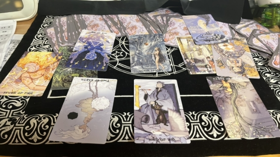

## **7.21**
### **1**
卡子哥这几天在干啥

主题牌：骑士，变动

过去，狐狸+老鼠补花园，偷偷摸摸地干活，社媒上的损害利益的人，他知道自己身边有老鼠，＆远离。

将来：十字路口+孩子，渡过选择期，迎接新生。

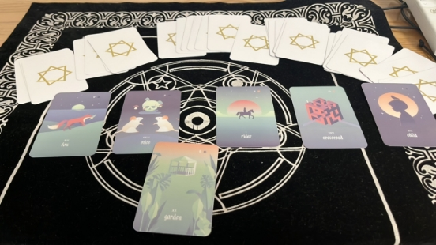

## **7.20**
### **1**
卡卡现在的身心灵状态～

指示牌/底牌：皇帝逆，回皇后，物质受损，感情富足。

身：权杖王后补命运之轮，行动力强的感情丰富之人+10号牌，终结与新生

心：圣杯四逆补圣杯七，不再沉思/停滞，心里全是他的七号

灵：圣杯侍从补星币侍从，感情、物质都会有一个新的开始的感觉。

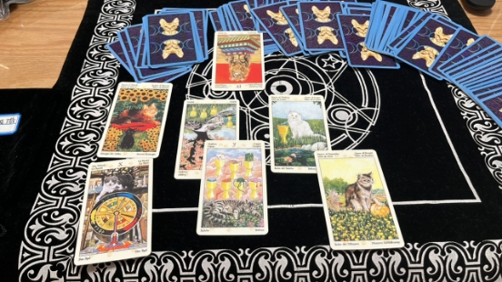

配平们罗的身心灵状态。

指引牌/底牌：星币王后，他的卡卡，他的王后

身：塔补星币四逆、宝剑王后，遇到大事，最稳定的不再稳定，理智清醒的感情切割

心：世界逆，完美世界只差一步，想的是魔术师逆，不枉我技巧百出，星币三逆，合约结束，宝剑一，切割开始。

灵：宝剑六逆补皇后，想奔去他的皇后身边，但不能动

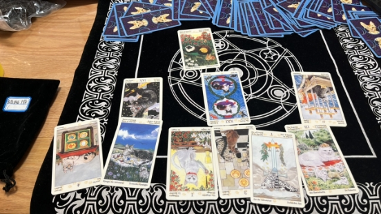
### **2**
卡娜的身心灵牌阵

底牌：星币一，新开始，且有钱。。。

身：权杖九补权杖三逆，受伤，且不想走

心：圣杯王后补恋人逆，想使用过多的情感/泪水/情绪，但没用，恋人逆嘿嘿😁

灵：星币骑士逆补宝剑国王逆，过度冷静理智的国王的切割下，坚定的承诺没有啦～～

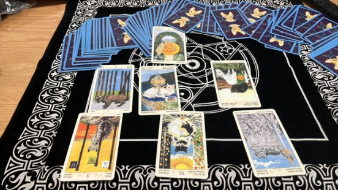

配平乔娜的身心灵牌阵。

底牌，皇帝，罗哥 is watching you

卡卡给了一张皇帝逆哦，大家畅想下一正一逆的姿势～

身：宝剑8补隐士（9）逆，想装看不见，但没用，卡卡不藏啦

心：权杖8补圣杯2，想去她的情人身边

灵：权杖王后逆补宝剑2逆，卡卡的身给了权杖王后正，低配版的乔娜的精神状态只能是权杖王后逆了，冲动又失位，宝剑二逆的牌面是一只猫小心翼翼地在两把剑里走钢丝，现在逆位了，掉下来是迟早的事。

这副牌处处照应着卡卡，无论是8号的大量出现，还是牌的正逆复现，也太巧了，卡卡深刻影响着今天的她！

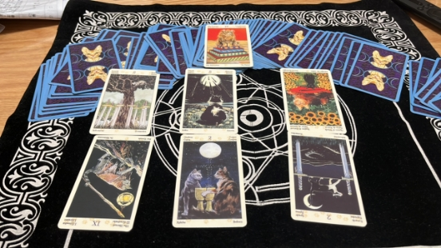

## **7.19**
### **1**
所以卡卡点赞kn故意搞事的ins 这件事，会如何发展？

雷我是渣渣新，大家看牌自行理解。。。

主题牌：刀，这是我抽出来的，不是预设的，刀，终结，离婚。

不可控的：心+十字架+树，长期感情相关的痛苦

现状：骑士+刀+幸运草，刀对的是骑士，总之，有置之死地而后生的感觉

可控的：蛇+老鼠+房子，卡卡知道家人中有一个只会害家里破财的坏女人，坏女人毁坏了家庭根基。

过去：心+骑士+蛇，陷入恋情的男人碰上了坏女人

现状：十字+刀+老鼠，痛苦/责任结束，但破财。

将来：树+幸运草+房子。

这排我不太能解，说出来和大家一起参考，按镜像法：心+房子/树+房子/蛇+房子，就是这个房子所指，有可能是们罗，也有可是长期在家工作，也有可能是家人中的坏女人，如果按斜线条法，来，心+刀+房子，心死了，有了新的家。真的好复杂，都说雷是一句话解决问题。。。我只能继续补牌。

房子补牌云+狗+百合，云的朝向是房子，看不清的家人，忠诚的纯粹的有性意味的好朋友，嗯，我倾向于们罗。

未来是：长期的家人带来短暂的幸运/长期的幸运的家庭，都很奇怪。继续补牌：

树补书+锚+鱼，长期的知识+工作+财富/知识+工作+财富的健康状况，这几张都是积极牌，可见就算工作变动，破财什么的，中长期看来不算坏事。

幸运草补孩子+熊+男人，又幼稚又成熟有力的男人带来的转机，看起来们十岁罗要出力了。

总之，祸福相依，大家都平静一点吧。我不觉得卡卡对中国有恶意，虽然我也很烦他的点赞…

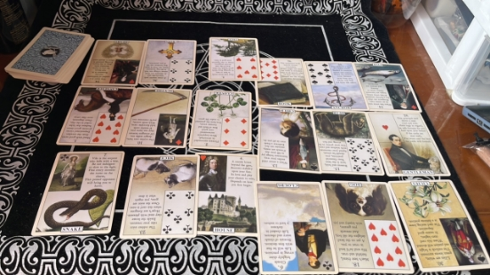

### **2**
Kn为什么发木兰是日本的，如何解决这件事

底牌：圣杯国王逆，卡卡的不顺、不满

原因：魔术师补雷诺曼的月亮+星星逆+星币国王逆。

她认为是灵机一动的“小巧思”，日子过得**太安稳**了（土+土+逆），她想作大妖（星星逆，回到塔）

表面上是发泄对爱情失意的不满，实际上是想让卡卡破财/事业不顺，毕竟kn 自己没有财和事业什么的，也可以进一步说恶心到罗哥。

坏女人！

解决办法：星币十逆，月亮，权杖四逆，破财、团队不和、争吵、离婚。

有火有土，还真是有行动有结果啊。。。

卡卡加油！

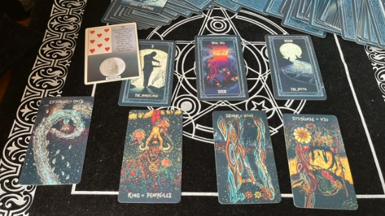

## **7.18**
### **1**
问kn 为什么用花木兰做主题办5月生日趴？

钥匙+船+鞭子+狐狸+男人，主题牌，鞭子，痛苦，身处痛苦中的人，扑克牌面j

前因：钥匙+船，旅行变动的关键，#造谣 为出去工作做准备

结果：狐狸+男人，偷偷摸摸的男人，卡卡你悄咪咪干了什么你说啊～

补牌了一下，花，骑士，信。

呃，如果是同性恋人，男人和骑士是一对这种话如果我不是刚从书上看到，真的会被你忽悠过去呢卡卡～

卡卡偷偷联系了罗哥，并给了对方一个惊喜/礼物～

果然每营业一次，就奖励自己和罗哥腻歪一会是吧卡卡酱～

描述主题：船+狐狸，暗中的异文化交流 ，阴谋，坏主意，呵呵，i 嫂果然在做这种上不得台面的事

总结：钥匙+男人，卡卡是关键，也就是说卡卡在这件事中处于主导地位，薅，卡卡加油～

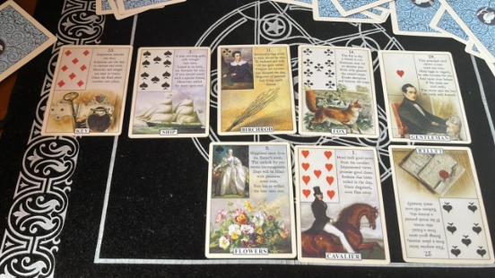

## **7.17**
### **19:36**
用雷问：卡卡会去澳大利亚参加女足世界杯吗？

四叶草+月亮+男人：主题牌，月亮。男性的声望让他拥有了机会。

挺贴卡卡的，他的名声确实很好，不过没有什么落实到行动的牌，也可能会有变数

按是否解法看，两积极+一中性＆两红桃+一方片

我还是觉得应该会去～

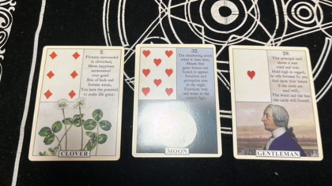

继续问，kn 会和卡卡一起去澳大利亚吗？

十字路口+锚+百合：中心牌，锚，有工作，财物的意思，但是锚也稳定的，不变动，百合则有性，家人相处的意思。

简言之，kn 去澳大利亚，关系到工作和钱，ok,现在连新上场的雷诺曼都知道kn 最关心钱了，这件事现在在选择中（十字路口），卡娜也许运用了性/家庭人员关系等理由要求去。

按是否看，1积极+2中性，倾向于去/2黑桃+1方片，又倾向于不去～

所以纠结卡卡，在线头秃，到底带不带这个挂件呢～

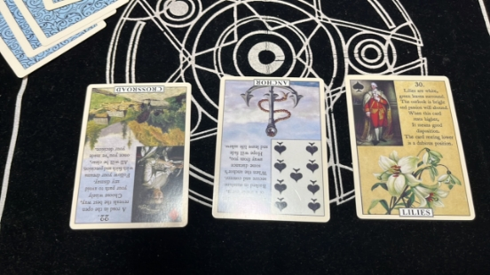
# **Freedom**
## **7.20**
### **1**
火速摸了一把

卡子哥离婚了吗？

离了，损失了一笔钱（但是数额不算特别大），等了很久终于可以“释放”了，哇，这个急不可待😏😏😏

现在的卡卡是收拾包裹准备出发的卡卡了，他要去投入真正属于他的战场了（狗剩你最好给我争口气）

怎么说呢，想象这天想了很久很久，但是真的摸到这种牌还是会有点感动，苦尽甘来啊，勇敢耶耶，不怕困难，加油冲鸭！
### **2**
会在今年官宣离婚吗？

概率极低，不是那个最好的时候，今年官宣反而会招来不好的事情（不确定什么事情，但是看着牌面还蛮危险的），现在官宣离婚容易鸡飞蛋打，反正我的牌就是说既然已经“脱困”了，别太想着一步登天，这样不好
### **3**
问：是彻底离掉了吗？

三张全正，圣杯三、权杖国王、愚人，一句话总结就是：卡卡重新掌控了人生开开心心地开始新的生活~
### **4**
看热闹不嫌事大

问罗妈知道卡子哥离婚了吗？

知道了，哦，我的另外一个儿子正向我走来（还出了一张世界正啊，啧，这个评价不要太高了），感觉罗妈也像我们吃瓜群众一样，罗妈原先也以为卡配罗be了，她心中的美好家庭就这样没有了，结果哎嘿，感谢世界杯，直接一波妙手回春，枯木逢春，老树开花（bushi

她认为罗哥千万不要放弃，一定要趁这个机会穷追猛打，彻底把卡子拐到老罗家来

我真的会笑不活😂

罗妈现在的态度就是：克里斯蒂亚诺你赶快往前冲！你正面封堵，我帮你断后，哪怕是绑也要把里卡多绑进老罗家（太有趣了！！！难怪会有罗哥这样的儿子🤣）
# **停云**
## **7.19**
### **1**

问kn把木兰发成日本的是想表达什么

也不是我想造谣或者阴谋论，但看样子她就是故意的啊……不安好心是肯定的。她发的时候，圣杯五逆，恋人逆，命运之轮，没当回事是肯定的，估计想暗戳戳恶心一下，现在是意外之喜了。补牌看圣杯五逆是节制，这里我没看懂，她是和卡子沟通失败了还是没谈拢，不肯带她出门？因为没获得满意的结果就要发癫吗，恋人逆没什么好说的，上次就出过了，他两已经不是貌合神离能描述的了，补牌星币骑士逆，卡子现在确实不咋搭理她了，不关注她。命运之轮补牌是星币九，这我只能想到离婚，因为她的各种行为导致离婚，所以她分到了大笔财产，再补了一张是宝剑国王逆，说kn失去了理智，很不成熟，无法自控情绪，心胸狭窄😅

底牌女祭司逆和星币五，主要是缺钱了，所以她很急。
### **2**

问kn发的ins对卡卡有何影响

底牌星币九逆和星币二逆，破财写在明面上，财务危机，失去不少物质条件。

已经到了卡子需要好好思考的地步了，他需要多倾听自己的心声，确定真正想要的东西和目标，这件事也启发了他，有思考就是好事，但比较poor的是，除了破财，还可能竞争失败🥲战车逆出了，总之牌都在劝他多表达自己被压抑住的情感，多为自己考虑一下，理清自己的人生道路做真正的选择。

宝剑七，这件事对他影响很不好，不仅破财还可能受到隐瞒和欺骗，最后还是要靠他自己的能力来解决（poor）然后是权杖五逆，想必家里已经在吵了🤣补牌星币七逆，kn又在分钱了，最好是在商量离婚财产分割，先接一个，但是进展不太顺，希望能早点分开吧。
### **3**
问罗妈取关qn是为什么

罗妈这里信息量不少，首先权杖一逆，她真的对qn

没耐心了，失去热情和精力，本身她就不喜欢她，现在是越来越不满了吧，都不想演了，so直接取关（）补牌星币一，可能她都催着罗开始新生活进入新阶段呢，这张牌物质和土元素很重，给人感觉就是很安稳，能代表谁大家都清楚🤣或者单纯就是觉得踹了qn，自己儿子能省好多钱（）

星币三补恋人，明示罗哥赶紧和卡子一起工作了，组成一个团队，大家都好务实，两人早日在一起能应对很多问题，不过到底什么时候能实现呢，罗妈的意思是很快了吗🧐

最后隐士逆，对于卡子出来工作她很支持期待，补牌宝剑四逆，这里含义既可以说卡子休息了不少时间了有精力处理事情，或者他通过思考和平静已经获得了新的感悟有动力去进行下一步，走入新的阶段；也可以说是遗嘱相关，所以如果罗遗嘱有卡子罗妈是知情的，卡遗嘱的情况不明，好像都说得通，又补一张是权杖五，主打一个争执打架，无论是伴随两娜下岗造成的争吵还是遗嘱财产等敏感问题打架都很合理，放罗和卡身上都没问题，不过鉴于问的是取关qn，我更倾向于说的是罗哥。
# **莫里亚蒂**
## **7.19**
### **1**
罗妈为什么取关qn，隐士逆补吊人逆，命运之轮逆补圣杯二，宝剑七逆补圣杯九

罗妈应该是知道qn快下岗了，有点藏不住自己的心思了，她知道qn现在在垂死挣扎，但是没用，她和罗哥的缘分已经走到尽头了，罗妈知道们罗哥心里住着另一个人，总之就是罗妈有点太开心了😂（Maybe还有点催自己儿子赶紧把卡卡娶回家）
# **小萝号**

# **暗线联络**

