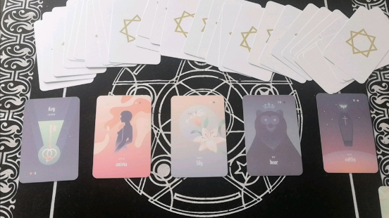
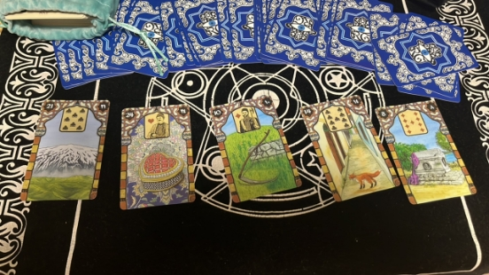
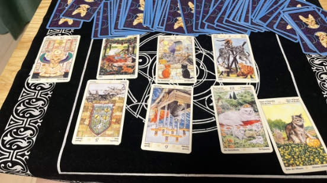


[**规则（暂行）**](#_toc141788899)**

[**正文**](#_toc141788900)

[**阿平**](#_toc141788901)

[**希音**](#_toc141788902)

[**7.30**](#_toc141788903)

[**7.25**](#_toc141788904)

[1](#_toc141788905)

[**7.24**](#_toc141788906)

[1](#_toc141788907)

[2](#_toc141788908)

[**停云**](#_toc141788910)

[**7.29**](#_toc141788911)

**

**同人创作（0724-0730）下半场** 

\***本文档为飞书版玄学楼第十一栋，运行时间预计07.24-07.30😊（依卡顿程度决定下半场）**

**规则（暂行）**

1. 瓷器law高于所有，千万不要边缘蹦迪❗️❗️❗️
2. 本文档一切同人创作仅作乐子，属于二次元虚构创作❗❗❗请勿过度zqsg❗❗❗
2. 🈲贷款，🈲rsgj，🈲过度发散，🈲诅咒
3. 本文档一切创作内容限制此处观看，🈲截图搬运到其他楼/组/社交平台
4. 本文档主旨就是同人🍬创作，🈲过度发散嫂、赛事等无关话题

**正文**
# **阿平**
没什么可更的了，给大家拜个早年吧要不？有想问的可以问问～

# **希音**
## **7.30**
长期工作的牌落在在卡卡的过去的一周，也就是说过去一周中，包括7.29，应该确实出现了卡卡长期工作的契机。
## **7.25**
### **1**
问，半年内，乔娜社媒上秀与罗哥的恩爱的情况，会如何发展？

钥匙+男人+百合花+熊+棺材。

主题牌：百合花，长期的。

前因:钥匙+男人，关键在男人，社媒秀不秀，关键在男人，罗哥是主导。

后果:熊+棺材。熊有母性的意思，也有地位、力量的含义。母性力量的终结，qn下岗应该是不远了。

对百合花的描述:男人+熊，强调了男人的力量，即罗哥在秀恩爱这件事上的主导地位。

总结:钥匙+棺材。长期的秀恩爱到了结束的契机。

很明显的，qn秀恩爱也是越来越少，罗哥需要再秀。

## **7.24** 
### **1**
问，kn 社媒上秀恩爱的情况会如何发展？

山+心+刀+狐狸+棺材。

主题牌是刀，抽出来的，决断，终结。

过去是有阻碍的/有靠山的感情，未来是阴谋的终结。

对社媒秀恩爱的描述是心+狐狸，这种感情是有阴谋在其中的。

对社媒秀恩爱发展的总结是山+棺材，秀恩爱会有障碍…

简言之，kn 的影楼照会越来越少的！

### **2**
卡卡为什么带kn 去营业，他潜意识里想表达什么？

底牌：正义

原因：权杖四、教皇、星币五逆，配合正义，卡卡确实进入了秀恩爱维稳的状态，他应该是付了一笔钱营业的。

潜意识：皇后补星币侍从，钱钱汇聚，应该也有收入。没表达出来的，权杖五，圣子自由保卫战，自己都没意识到的，宝剑六逆，想走走不了。

八张牌，数字五出现了4次，这件事上卡卡应该是努力突破规则与限制，在冲突中寻求新的发展。

# **Freedom**

# **停云**
## **7.29**
问kn为何最近度假没怎么秀恩爱

kn除了出去玩这段时间，最近都比较安分，不像她的作风，摸一把看看。

首先是因为卡卡，他不让秀，并且为了让kn“听话”给了钱，她拿了钱挺美滋滋的，就闭嘴了。心情是挺不错的，但只是表象，出了月亮，她其实对未来也迷茫了，也没什么大的信心，对感情有不安，会比较情绪化，鉴于应该提离婚了，她有这个变化也很合理。然后是审判逆，我认为就是提离婚导致的，现在大家都还在演戏，都在打造表面的“和睦，幸福美满”的家庭形象，但kn已经来到了生命中的重要节点了，这张牌出说明当事人知道无法逃避，想拒绝这个改变，不愿意作出决定，或者是kn目光短浅，做不出决定，如果过去有过不好的行为，也可能导致自食其果哦☺️

其实只是提取了主要的点，像卡卡给钱让她闭麦，卡子心思不在她身上在专心工作这些就不细说了，kn拿了钱确实很开心，开心到自己都骗到自己了，觉得现在的生活很不错，不过表面的平静终究是一时的，她的潜意识里也在不安和逃避，只不过在等铡刀落下了，总有一天她不得不面对。
# **莫里亚蒂**
# **小萝号**
# **暗线联络**

