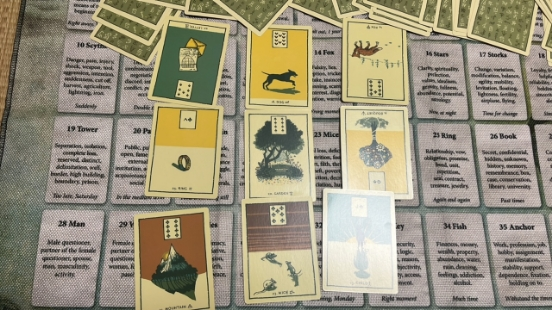
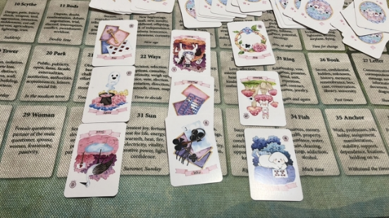
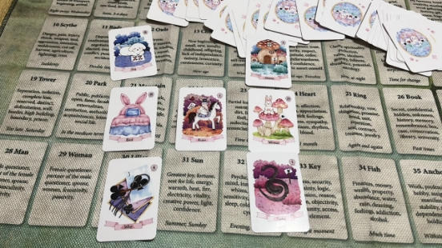
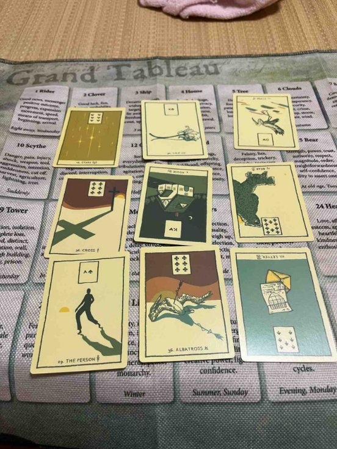
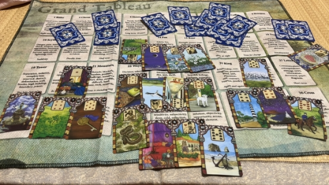
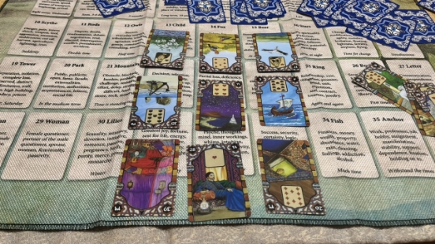
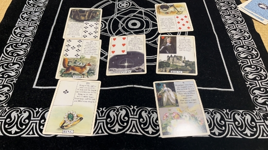
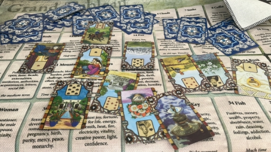
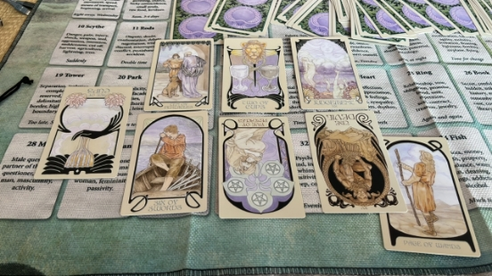


# 目录
[**规则（暂行）**	2](#_toc142254366)

[**阿平**	2](#_toc142254367)

[**希音**	2](#_toc142254368)

[**8.6**	2](#_toc142254369)

[**8.3**	7](#_toc142254370)

[***8.2***	10](#_toc142254371)

[**8.1**	11](#_toc142254372)

[**Freedom**	12](#_toc142254373)

[**停云**	12](#_toc142254374)

[**8.5**	12](#_toc142254375)

[**莫里亚蒂**	13](#_toc142254376)

[**小萝号**	13](#_toc142254377)

[**暗线联络**	13](#_toc142254378)

**

**同人创作（0731-0806）下半场**

\***本文档为飞书版玄学楼第十二栋，运行时间预计07.31-08.06😊（依卡顿程度决定下半场）**

**规则（暂行）**

1. 瓷器law高于所有，千万不要边缘蹦迪❗️❗️❗️
2. 本文档一切同人创作仅  乐子，属于二次元虚构创作❗❗❗请勿过度zqsg❗❗❗
2. 🈲贷款，🈲rsgj，🈲过度发散，🈲诅咒
3. 本文档一切创作内容限制此处观看，🈲截图搬运到其他楼/组/社交平台
4. 本文档主旨就是同人🍬创作，🈲过度发散嫂、赛事等无关话题

## **阿平**

## **希音**
### **8.6**
#### **5**
卡娜家人眼中的kk和1.5的关系是什么样的。

主题牌，庭园。岳家看一对小夫妻居然认为他们是公开、社交的关系，#造谣 表面夫妻这不就实锤了。

过去是信+戒指+山。纸面契约有阻碍，可见起码两个人关系是很不顺的。

现在是，狗+庭园+老鼠，连表示凝聚力的社媒都有损害，我觉得应该解为卡卡不愿意演了，演得会越来越少。

将来是狐狸+花束+孩子，偷来的礼物新生了，应该是指关系有了新的变化，但是不会公开，他们依旧有利可图。

不可控的＆现状不说了，基本就是卡卡占主导地位，但社媒关系还是要偶尔维护的，他们认为这也是花束（好事，幸运的事）。

他们认为可控的部分，山+老鼠+孩子，有靠山、有损害卡卡（老鼠）得到的收益，也可以指kn(我牌经常给kn老鼠），有孩子。也就是说，表面上（现状）说按协议（戒指）维持公共关系（庭园），把这当成礼物（花束）。

实际上还觉得有靠山、有kn、 有孩子，他们的利益（老鼠带来的）、希望（孩子）还在后头呢。。。

这里的山除了靠山，也可以是阻碍的意思，反正就是出现了困难也没事，有钱，有孩子，将来指不定还有戏的感觉。

欠一个罗尼收拾他们。

#### **4**
问卡卡和oppo 的关系会如何发展？

主题：房屋，与Oppo 关系的发展变化和家人相关。

幸运草+刀+房子+女人+棺材。

过去，幸运的决断。

未来，女人带来的结束。

整个发展果然是不好的。kn 这个败家精。

按影射法解的牌是，整件事（关系发展）的总结是幸运艹草+棺材，好运的结束，对家人这个主题牌的描述是，刀+女人，挥刀的女人，决断的女人，从牌看，很明确就是kn 败事有余。

不过问了一下结束之后会如何继续发展，花+送子鸟+信。

后续发展应该是改变、升级的好消息。

#### **3**
建设一个奇奇怪怪的关系～两娜之间的关系。

乔娜眼中的卡娜：钥匙+灵体+送子鸟，灵体上下都是积极牌，这张灵我会解释成积极牌，守护灵。差不多有两个意思可供参考，她认为关键的守护力量是名份的提升/解决办法是怀孕，总之，既需要kn跟卡子结婚来维持她的地位，又看不上她只会怀孕。

卡娜服中的乔娜：戒指+女人+狗，达成协议的女人是朋友。卡娜连看人都比较傻白？

两人的关系是骑士，补市场和鞭子。消息的传递，而且很巧，这张骑士是逆位，是从kn 向qn 的方向，也符合我们在社媒上看到的kn 比较迎合乔娜的情况。

补市场，交易；鞭子，既有争执又被鞭子捆在一起，这两女人明面上有这么复杂的关系吗？似乎都没见过吧，只能跟两夫夫有关了。

一句话，两娜锁死。

#### **2**
半夜了码一个甜/凰的～

眼下，卡卡和罗哥的关系如何？

卡卡眼中的罗哥：狗+床+鞭子。

狗子是忠诚的伙伴，，。

我基友/男人（狗）在床上（床）活力无限，你来我往（鞭子）。鞭子的牌面梅花J，激动的小男孩～

罗哥眼中的卡卡：房屋+女人+蛇，卡卡是他的家，他的女人，他的禁果（蛇诱惑亚当夏娃吃下禁果）。

两人维系关系的关键是骑士，变动、好消息，巧的是从卡卡的方向向罗哥这边，不过雷不讲究正逆位，大家先快乐吃糖～

卡耶耶即将出发！

#### **1**
问乔娜为什么po 一群娃娃的社媒。

主题牌：房屋，家庭。

乔在用家庭给罗哥施压，这副牌中有两张36号牌，都出现了，这种重担、压力是乔娜从过去开始一直在向罗哥灌输的，并且她很擅长这点，牌把家庭的重担归于现状和乔娜可掌握的部分，可见们罗确实是很重视家庭，否则不会给乔这个机会。

但没用，乔不能掌控的部分是星星+百合+送子鸟，乔的希望、目标是长期的升级/改变），也就是说，乔希望她能从女朋友升到wife,嘿嘿，但这部分她控制不住，罗哥不会娶她

现状是她感到了重压家庭的力量，估计是罗哥的一系列处理方式令她承压。

未来看不太清楚，送子鸟+熊+信息，可以是继续升级的权威力量会在社媒展现出来，那就是乔被压制得越发明显，也可以是改变的母性力量的消息，我当时没补牌，但既然是消息，我觉得我们会看到～

不急～你方唱罢我登场～

### **8.3**
#### **1**
问一下，两老汉遇到的山的事件是什么。

主题牌：书，秘密。

男人（男人）的决断（刀）的秘密（书）遇上了阻碍（山），引起了阴谋（蛇）。

鉴于昨天的情况，我给每一张都补了牌。

刀补月亮、鱼、百合，决断跟名声、钱、爱情有关，大概就是离婚。

书补送子鸟、狐狸、狗。秘密跟变化、暗中谋划、团队相关，狗也可以是感情里的第三方，总之，是两老汉之间感情，偷偷谋划在一起相关的秘密。

蛇补床、房屋、锚。家里人、枕边人的阴谋，具体看不出是哪个人，但应该是个女人，扑克牌面为女，锚也有与社会连接的意思。

男人补香炉、四叶草、钥匙。清除是幸运、快的解决方法，应该是卡卡。卡卡最近动作可能急了引起两娜的反弹了。

山补高塔、星星、骑士。阻碍和工作机构的目标变动有关，估计对卡卡的工作有影响。

#### **2**
问：上一组牌中山的事件会如何发展。

主题牌：男人。

新生（孩子）的工作机构（塔）遇上了选择（路口）的人。

最后一张牌是骑士，男人还是在动，有动的勇气。
#### **3**
又给未来的骑士补了一个九宫格，不详细写了。

总之，主题牌，星星，这个变动的消息与目标有关。

不可控的部分又出现鸟，谣言会变多。未来有船，会动的会动的。

骑士的目标的可控的部分：床上的男人是秘密（书）。

噫，罗小小依旧没名没份啊，小小手绢都咬烂（bushi～

#### **4**
卡子哥和小安之间关系如何～

嘿嘿，小安还藏着有小心思，大概是把卡子哥当天上星星看了，长大了之后还偷偷藏着戒指（约定），卡子哥当家人的爱吧～嘿嘿😈

小安，弟弟就是弟弟～啧啧啧

问：小安和罗的关系～

哈哈哈哈我要笑不活了，问小安和罗的关系，戒指跑到罗哥这啦～

小安：鼠辈，我已经不爱了（刀+心，结束爱意 ）。

罗哥：我的联系、契约、约定（戒指）升级了（鸟），我们还有前路（道路），你没有 。

两个人之间的关系是孩子，新生的、幼稚的，好的，罗三岁和安三岁上线。

***8.2***
#### **1**

### **8.1**
#### **1**
上次有哥哥问，罗哥在赛场上比G，卡卡看到后心里怎么想？

底牌圣杯一逆，感情结束了。

表达出来的，他有了一个好团队，稳定下来了（星币十），感情看起来也不错（圣杯二），我该走了（宝剑六，牌面是一个男人划船离开）

潜意识部分，我变得幼稚＆冲动但我必须克制自己冲上去的欲望（恶魔逆补权杖侍从），虽然没说出口，我也知道我和他都在经历心灵的死去活来（审判），虽然我压抑自己，告诉自己没事他很好，但我自己都不能直面痛苦啊，我总是回忆起我们一起撑过死里逃生的四年的日子（星币五）。

## **Freedom**

## **停云**
### **8.5**
问卡卡最后选择的长期工作是怎样的

不出意外就是st的工作了，卡要面临的困难不少，首先他接这个活就会被议论，不被肯定，补牌详细看，工作是有贵人出手相助所以定下来了（教皇）宝剑国王我认为是和kn有关，鉴于不会让她跟着去st，那合同条款涉及法律等专业内容和相关人士是合理的，去往st前也要把她处理好。宝剑四逆补权杖侍从，们卡卡是铁了心要出来上班😂他已经是全新的里卡多了，要和过去说再见，目的地宝剑六，出远门呢。最后是宝剑一逆，前面说卡卡的困难不少，这份工作也是，事务繁多耗费很大精力，麻烦也很多，但可以让他终结和kn的关系，形成一种分离的状态（恋人逆）他费这么大功夫图什么呢……是圣杯国王，们罗哥盼好久了，眼巴巴等着🤣

再问一个本泽马之前关注卡卡并点赞love wins的，其实我一开始只是间接想问问看卡工作相关，因为他有可能不仅是吃瓜卡配罗，还可能是知道卡卡要来st。但是他成功让我脑过载了（）我也不知道到底是他心思拧巴乱出还是骗我不想让我知道随便出的，目前只看得出底牌圣杯三，他关注卡应该两者都有，去了st某种程度上等于圈内公开，他认为是打破了圈子的陈旧传统，但要（节制）。后面的就看不懂了，宝剑三，你难过个什么劲啊😧补牌塔，很迷惑，再补一张是星币四。后面甚至审判逆星币六正义逆，大晚上看得我脑袋疼，不想分析了，严重怀疑他在驴我😩或者有哥哥帮忙看看吗

## **莫里亚蒂**

## **小萝号**

## **暗线联络**
那个卡娜定制的项链是卡卡主动戴的，不存在卡娜的逼迫，应该是出于他自己的考虑（避险？），虽然戴得并不舒服。看样子很快就能摘了，可能就在这个月，会得到别人非常强有力的解救（伴随着离婚进度的推动）。不过“救”他的人要付出挺大的代价，属于自损八百型的。

C罗对乔治娜小助理在他房子里游泳摆拍怎么看？

首先讲这个房子不是他心目中最重要的一栋，离得远又空着，让乔治娜等人暂住一下演戏没什么大所谓（指不爽但在心理承受范围内）。演好这个戏也是对他目前的事业有助益的。但绝不会让他们长久住下去，不会把房子分给乔娜。最后他也是有点心理洁癖在身上的，认定最重要的那栋房子不准备让乔娜染指分毫。

