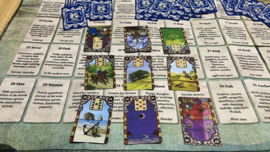
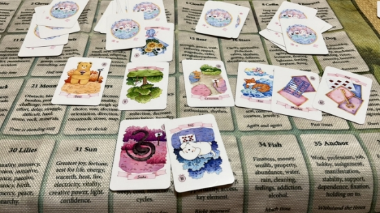
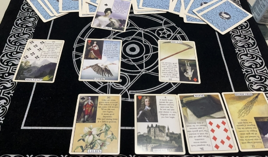
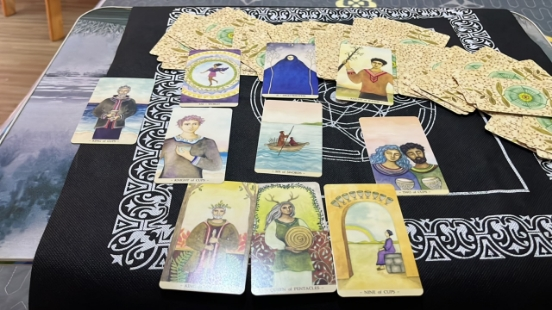
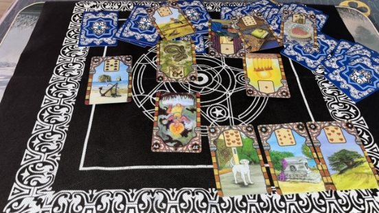
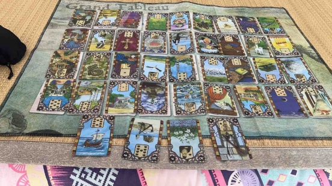


[**规则（暂行）***](#_toc143801065)***

[***希音***](#_toc143801067)

[**8.20**](#_toc143801068)

[2](#_toc143801069)

[1](#_toc143801070)

[**8.18**](#_toc143801071)

[3](#_toc143801072)

[2](#_toc143801073)

[1](#_toc143801074)

[**8.16**](#_toc143801075)

[1](#_toc143801076)

[2](#_toc143801077)

[3](#_toc143801078)

[**8.15**](#_toc143801079)

[1](#_toc143801080)

[***停云***](#_toc143801082)

[**8.20**](#_toc143801083)

[1](#_toc143801084)

[2](#_toc143801085)

[3](#_toc143801086)

[***Procyon***](#_toc143801090)

**

**同人创作（0814-0820）**

\***本文档为飞书版玄学楼第十四栋，运行时间预计08.14-08.20😊（依卡顿程度决定下半场）**

**规则（暂行）**

1. 瓷器law高于所有，千万不要边缘蹦迪❗️❗️❗️
2. 本文档一切同人创作仅作乐子，属于二次元虚构创作❗❗❗请勿过度zqsg❗❗❗
2. 🈲贷款，🈲rsgj，🈲过度发散，🈲诅咒
3. 本文档一切创作内容限制此处观看，🈲截图搬运到其他楼/组/社交平台
4. 本文档主旨就是同人🍬创作，🈲过度发散嫂、赛事等无关话题

# **阿平**

# **希音**
## **8.20**
### **2**
浅看一下为什么qn社媒删掉罗哥。

公园+塔+骑士+戒指+老鼠。

起因：公园+塔。社媒的压力，想借社媒宣示主权。

主题牌：骑士，一个俊美的男人。

后果：戒指+老鼠。契约的损失，再不按契约要求，会有损失。

描述主题牌：塔+戒指，工作机构的契约，配合变动的骑士带来的好消息，鼠愿：共舞st.

描述整个事件：公园+老鼠，社媒的损失，qn 越作，损失越多。

### **1**
罗哥是否真的有买巴西俱乐部的打算？

鱼（钱）+星星（主题牌，愿望）+百合（长期）

按牌性来分，两积极一中性，按牌色来分，两红一黑，他是真的有这个打算～

罗哥买巴西俱乐部的事情会如何发展？

主题牌：市场，交易。

前因：信，消息，所以被我们知道了。

后果：月亮，名声，浪漫爱情故事。#造谣 恋爱脑型事业批是这样子的，月亮奔你而来是吧～～

事件情形：熊，权威人士/力量。

事件后续影响：鞭子，争执、沟通，补锚+太阳+男人。稳定的开心的男人。

卡卡如何看待罗哥买巴西俱乐部的事？

主题牌：树，长期计划。

笑发财了，卡卡觉得可以掌握的是锚+月亮+床，稳定的爱情和滚床单是吧，果然，可怜的克里斯，被他玩弄于股掌之上.jpg～

但这件事如果要落实，罗哥（男人）就要清除（香炉）一些侥幸心理（幸运草），这也是卡卡觉得不可控的部分。

因为未来有鸟，如果真的落实了，谣言不会少。

## **8.18**
### **3**
卡卡为什么发小胜利相关的社媒～

主题牌：树，舒缓，长期计划，感觉在安抚罗哥啊，

事件情形是花束，礼物，善意。

结果是路口，选择，补狐狸（工作），市场（交易），钥匙（关键）。啊，卡卡是不是在吐槽狗剩引援不力啊

### **2**
kn如何看待她父母发在社媒上的消息～

主题牌：狗，她还把家里当团队的，她认为新产生（孩子）男人（男人）的贪婪（老鼠）是可以控制的，好的，我们祝她继续作吧。

卡娜现在也在选择节点上（路口），这是她不可控的部分，不知道会选到哪里呢，但未来的部分有幸运草（短暂的幸运）和老鼠（损失），随便吧，不纠缠卡卡就行～
### **1**
问kn 家人为什么在ins 发鸡汤？

Kn 家人遇上跟女人（女人）相关的困难（山），为了提升（送子鸟），最后会有个决断（刀），现在家人（房子）在秘密（书）吵架（鞭子）。这件事会长期（百合）折腾下去。

## **8.16**
### **1**
看了一下卡卡如何看待罗哥在庆祝的时候不接受队友的抱抱。

底牌圣杯国王，说出来的部分有世界，里卡多是又喜爱又满意无疑了～

恭喜罗哥答对一题～

自己都没意识到的部分是宝剑六，补权杖国王、星币王后、圣杯九，感觉动的能量还是蛮明显的。

### **2**
问：卡卡如何看待狗剩的引援花费大大小于其他f3的事件。

中心牌：蛇、阴谋、恶意。们卡卡前几天才说的公平竞争奖。🚬

前因：锚、工作、事业。

事件现状：鸟，已经议论得沸沸扬扬了。

后果：太阳。这事结果还不错的样子，给结果补牌，男人+书+心，男人秘密的爱情。。。好的，可能是对谈恋爱有助力。

事件影响，灵，直觉，补狗+棺材+树，这事的后续影响可能和团队的结束和重建有关，具体看不清楚了。。。

### **3**
卡娜怎么又在社媒上罚点呢？

主题牌：孩子，孩子牌再次出现。

起因：山，困难

事件现状：百合，长期的，成熟的

事件影响：熊，权威力量

结果：星星，希望，但远。没有什么行动。。。

总之，kn 还真是贼心不死啊，希望一直没行动下去。
## **8.15**
### **1**
问：马儿去st 对卡卡共舞st 有帮助吗？

好像，还真的有助力。

设定骑士是马儿，西装男卡子， 长袍男是罗哥，锚是卡卡的工作，蛇qn，鼠kn。

卡卡的新工作，卡卡很主动，钱也很多。

老鼠在第一宫，对kn 影响很大，又垂死挣扎（孩子），鸟又出现，谣言，还有床。卡卡，你到底是去工作的，还是去睡人的？

卡卡和马儿在一个九宫格里 他们互相影响。

卡卡现在应该是处理一些困难，可控的部分有山。他在努力解决，不过最远未来是太阳 ，最好的一张牌，结果很不错。

罗哥面对过左边，是过去已经存的蛇，未来是卡卡正在处理的山 ，Xql 在捉内鬼

罗哥那一行的最远未来是书+树+云，秘密被长期遮盖，我们不会知道。

罗哥可控的部分是熊+棺材+香炉，母系/权威力量结束，被清除。

数七看未来：

心，里面有香炉+老鼠。感觉离将来Kn 消失，似乎更近了。

卡卡的数七有qn (蛇），感觉要有一些斗争，底牌也是鞭子，这几天xql 应该不是在妖精打架，而是真的在沟通，争取。

但是我们不会看到，花园牌（公开）在最左下角，压力很大，上面压着老鼠+市场+路口，肯定不想让我们看到的。最远未来是右下角，狐狸，偷偷地，我们只能靠推测了。

两娜也在一个九宫格里，互相影响，现在他们之间的串连是市场（交易）+孩子+ 十字架（重压），真贴切。

两老汉也在一个九宫格里，互相影响。中间牌是心和鸟，爱的提升，xql 最近感情一定很好～

# **Freedom**

# **停云**
## **8.20**
### **1**
已经连续好几天梦到卡子了，尤其是周六白天补了两回觉又都梦到了，问一下他想跟我说什么。

简单看一下，底牌权杖5，牌是星币女王逆，宝剑7，节制

比较有意思的是，后续补牌，星币女王下面是宝剑三逆，结合底牌权杖五，像是暗指卡娜。宝剑七主要含义是不要放弃，补牌圣杯国王和圣杯2，好了好了，知道你很急了🤣节制补了宝剑10，他是不是想说工作快落定了，再坚持一下，后面跟权杖女王，行动力和热情都不缺。

没想到的是底牌，卡子家貌似每次问不是在打架就是在打架，本来今天这个问题就只是随便看一下，连续几天都梦到他实在太巧了，也就我刚入坑卡配罗时有几天梦到他们两个，但牌面又挺合理的，也不像在瞎说逗我玩，相信他这一回😂卡子哥你加油，黎明前的黑暗过去了就好了，们罗哥在st等你啊。
### **2**
问罗哥团队里的内鬼，罗哥和卡卡怎么对待

罗：世界逆

卡：星币侍从逆

提示：宝剑7逆

底牌是权杖三逆，直接点明了团队内部有纷争，看法无法统一导致合作出问题，后续还出了死神，会有一个结束。

罗哥这边处理起来会有点问题，打架是一定会有的，不过我们可能看不到，结果是清扫干净等卡卡来🥰卡子认为内鬼自身能力不足还野心过大，财务状况有问题，同时还觉得ta表里不一，们卡卡挺看不上的🤣但他认为此人可以用钱打发走。
### **3**
问C罗卡卡最近对对方的感情

这个就轻松多了，爱看，罗对卡：恶魔，卡对罗：权杖女王

底牌权杖六，简单看就知道小情侣成果喜人，也许离好消息不远了，感情也好得很，恶魔……嗯🥰

# **莫里亚蒂**

# **小萝号**

# **暗线联络**

# **Procyon**
(和搞八字的朋友聊日柱聊出一点点感想，没头没尾的更新一点～⚠️八字不能单论日柱的，这里只是单纯的谈一点解释)

我用的是他俩谷歌上的生日，粗糙排了下生时但没有根据流年校对……不过不影响日柱。

俩都是乙亥。乙木本来就是非常柔韧(不是坚强)的小草木，一般意象取为花花草草藤萝灌木之类的。亥水为阴水，藏甲木和壬水，所以乙亥的取向一般是莲花之类的，生于冷水清池中非常高洁的，柔弱的，中通外直不蔓不枝的植物。

但高洁归高洁，乙木嘛，不论男女，最明显的特点就是总想找个什么玩意依赖一下。再看下藏干，甲木是乙木最爱的天干之一，因为高大坚强的甲木可以给乙木提供攀缘生长和借力的条件，所以其实是内心有靠，更坚韧一点。区别是这依然是脆弱易碎的坚韧。这是因为壬水为江海水，水多木漂，柔弱的小花草是很不喜欢这种水的。因此乙亥总体的性格其实有点别扭，外表不太凌厉，但内心很有主意，而且聪明有心气。感情上则被动，很能憋，细腻敏感，不爱强求，不屑妥协。也就是说，其实内心里一直在喊着「有没有人能让我依靠一下呀🥺」，但表面上波澜不惊，稳若老狗。(比方说其实在没有纠缠对方的时候，两个人也总依赖着什么，比如宗教，比如老爸，比如不停找恋爱对象，比如两个人关于足球的不同信念……反正就是光自己一个人的话就会各种不安)

因此虽然传统说法乙木+甲/丙/庚都是不错的组合，但个人体感是和甲木在一起的乙木比较幸福，因为价值观更容易接近且最能满足乙木的依赖欲望。而当两棵契合度极高(看其他几个字)的乙木相遇的时候呢？简直就是隐藏款金卡……

内心戏会 be like: 「有没有人能让我依靠一下呀🥺」➡️ 「这里有个好高洁好纯粹的人，他好美，我们本质好像，但我没有的他都有，天呐🥺」➡️ 「我可以靠近他吗🥺」➡️(漫长的纠结，忍，摊牌，靠近之后)➡️「贴贴贴贴贴贴贴贴🥰一辈子都不要分开！！」

于是就会变成两棵纠缠在一起的藤蔓，扒拉不开。他们贴在一起也不会刻意去干啥，但就是要贴贴。只要能在一起就会觉得安全快乐，能够互相依赖提供支撑，而且都欣赏对方的品格言行。

这种感觉体验过之后我觉得根本无法接受别的，因为太美好太理想化了(再次强调乙亥疯狂的依赖欲+心气高要求高的特点。我甚至认为对于许多乙亥而言，找到可以依赖的东西/人就是人生终极目标)。同时，甲木为乙劫财，壬水为正印，乙亥人就是很容易被伴侣牵着鼻子跑并饱受感情煎熬。。嗯😐反正你们都找到纠缠对象了，吃点苦就吃点苦吧。反正如果说他俩的人生终极目标就是纠缠着贴贴，我是信的😐……

(再次强调八字不能单看，仅介绍乙亥的两个特点～欢迎别的学霸哥哥踢踢意见～

