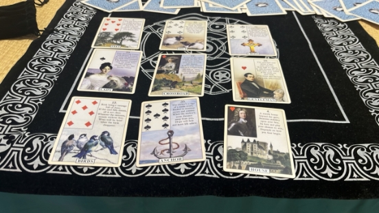
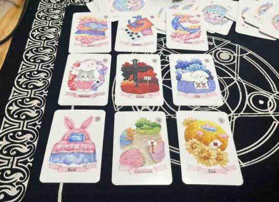
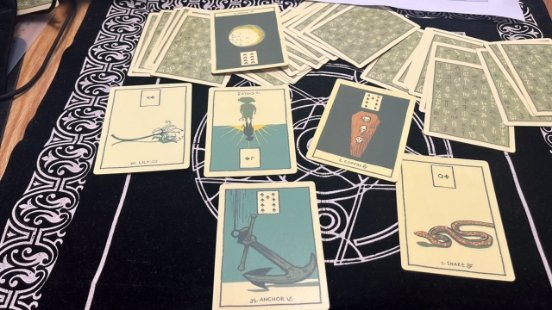
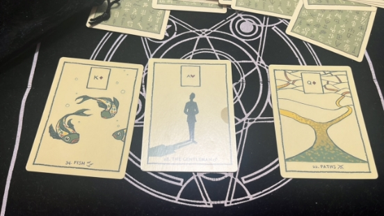


# 目录
[**规则（暂行）**	2](#_toc144654103)

[**阿平**	2](#_toc144654104)

[**希音**	2](#_toc144654105)

[**9.2**	2](#_toc144654106)

[**8.31**	3](#_toc144654107)

[**Freedom**	6](#_toc144654108)

[**8.30**	6](#_toc144654109)

[**停云**	7](#_toc144654110)

[**8.30**	7](#_toc144654111)

[**莫里亚蒂**	7](#_toc144654112)

[**小萝号**	7](#_toc144654113)

[**暗线联络**	8](#_toc144654114)

[**Procyon**	8](#_toc144654115)

**

**同人创作（0828-0903）下半场**

\***本文档为飞书版玄学楼第十七栋，运行时间预计07.828-09.03😊（依卡顿程度决定下半场）**

**规则（暂行）**

1. 瓷器law高于所有，千万不要边缘蹦迪❗️❗️❗️
2. 本文档一切同人创作仅作乐子，属于二次元虚构创作❗❗❗请勿过度zqsg❗❗❗
2. 🈲贷款，🈲rsgj，🈲过度发散，🈲诅咒
3. 本文档一切创作内容限制此处观看，🈲截图搬运到其他楼/组/社交平台
4. 本文档主旨就是同人🍬创作，🈲过度发散嫂、赛事等无关话题

**阿平**

**希音**

**9.2**

**1**

kn 改社媒简介是什么情况？

这个牌面我自己都没想到，男女分列现状两端，中间隔着路口，这不就是这两个人分道扬镳嘛？过去是女人在媒体（鸟）上显摆，将来却是男人在家里（房屋）做主，太贴切了。罗罗探头：我最听卡卡话了～～

主牌，路口，这件事是个点，选择过后，变化会展现的。

kn 不可控的部分，长期（树）的损失（鼠）重压（十字架），是卡娜承受不住的损失压力了。

kn 可控的部分：媒体（鸟）稳定（锚）的家庭（房屋），一时半会kn 也不会下岗，在媒体上演呢。

未来：权威（十字架）男人的家庭（房屋），卡卡会越来越有掌控感的。该，让你把狮子当小猫，呸！

**8.31**

**4**

卡卡去st工作的状况～

卡卡压力很大，但是选择权在他手中，结果不错～

强调：过去工作的原因，秘密的女人在床上，你们俩都把对方当妹子宠是吧～快床上打一架让我康康胜负～

**3**

卡娜晒证对卡卡有什么影响？

过去，百合，成熟隐忍男士

现状，孩子，新生。

未来，棺材补蛇，终结身边的诡计。

事件现状：月亮，名声。这就kn 在追求浮名。

事件影响：锚，长期工作。

**1**

卡娜为什么突然晒证？

鱼+男人+路口

多金的男人在选择/路上。

这牌也太明确了吧！

kn 为什么选择快拍这种会消失的社媒晒？

幸运草+月亮+骑士

主题牌：月亮，名声 。她就要这个名头。

短暂（幸运草）的名声（月亮要有新的消息（骑士）。

她有晒的虚荣心，但如果太过分就会被卡卡阻止，所以，擦边晒。

**Freedom**

**8.30**

**1**

问蓬蓬为什么要发这张照片？

蓬蓬觉得这是一切的开始（愚人正），总觉得蓬蓬好像有点卡毒唯（摸不着头脑），是两个笨蛋画彼此为牢的开端

总觉得蓬蓬好清醒啊，他一边磕得厉害，一边又很理智地认为这是两个大笨蛋，道路千万条偏偏选择了最难的那一条

（谁说不是两个大笨蛋呢）

**2**

问蓬蓬现在怎么看kpl的爱情

黎明前的黑暗，两个人都在负重前行，离胜利好像就差一层纸了，但是这层纸格外难突破，但是恒心毅力决心都不差，反正就还是等

**3**

还旁敲侧击问了一下，问卡子哥的st工作怎么样了

蓬蓬先来了一个宝剑二正，我还以为他不打算说了，但是又那么巧地刚好有另外的牌一起出来了，翻过来一看权杖五逆，后面又抽了一些牌，就怎么说呢，我总觉得蓬蓬眼里KPL的爱情好苦好难啊

但是再苦再难也有希望藏在下一个角落，好复杂啊，感觉很难用一两句话来解释的那种

但是就怎么说呢，虽然在蓬蓬眼里KPL的爱情之路很困难，但是同时在他眼里他也觉得这两个人从来没有真的放弃过

感觉就像是在地震带上建高楼大厦的那种……

**4**

再问问看卡罗两个人现阶段怎么看他们两个的爱情（又双叒叕对上了）

卡：很想和罗哥在一起，属于着急到要嘴上冒泡的那种着急

罗：我的爱情故事还差一个人，我正在等他来

**停云**

**8.30**

问罗哥为什么进球后比心

可能是我的提问有问题，也许不该问为什么而是问他想说什么🥹

总之出了一堆他工作和生活上的牌吧，首先他会比心是因为开心（废话）星币三，团队合作取得了成功，但罗哥心里有疑虑担忧，并且对狗剩现在的状况哦是不满的，当然他应该没表现出来🧐作为个人，他已经很成功拥有了很多，哪怕是去了st也还是看着挺好的，也取得了不少成绩，但他心里有点憋屈😂目前没有更多的动力去做更多了，或者说现在获得的不是他最初想要的，那我就理解成美中不足是没有卡子哥啦，们罗哥一个人在st拼事业经常感觉自己很孤单寂寞（）团队也时常让人心累。

后续可能会产生纷争（权杖五）要小心暗中的陷害或者流言中伤，整体他的状态在历经低谷期和巨大的压力后是已经改善的（宝剑九逆）

之前都以为去st能轻松但实际情况并非如此，罗哥面临的幺蛾子也不少，前面说了他有担忧，并且压力也不小，然后转头就出权杖十逆，罗哥也打算放下重担了，他这牌出的可比卡卡干脆多了🤣

底牌愚人，总之罗哥很看得开，他开心就好

**莫里亚蒂**

**小萝号**

**暗线联络**

**Procyon**

